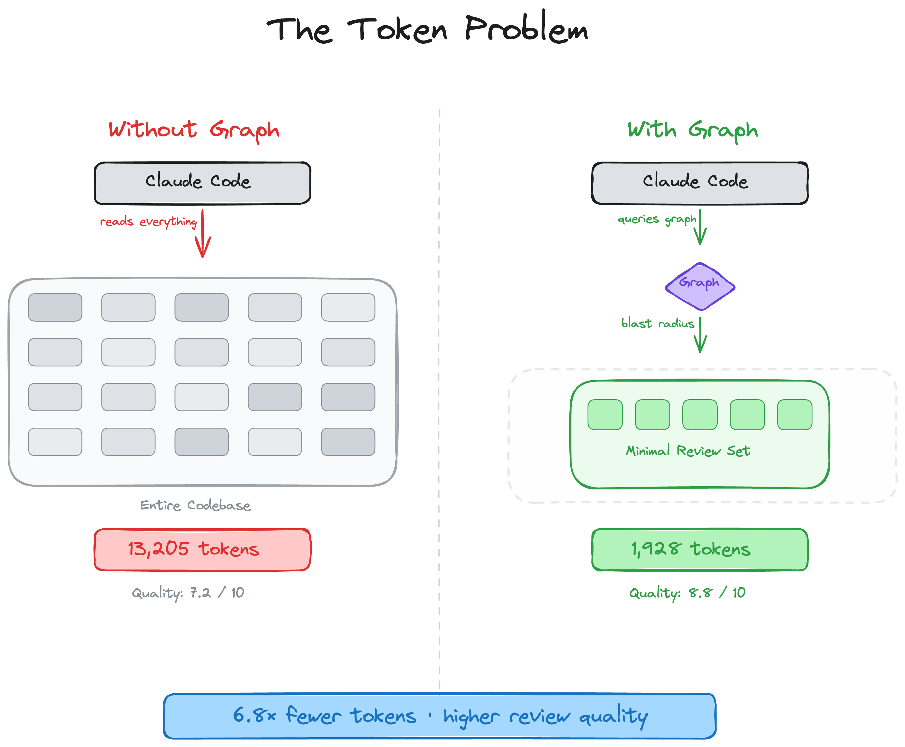
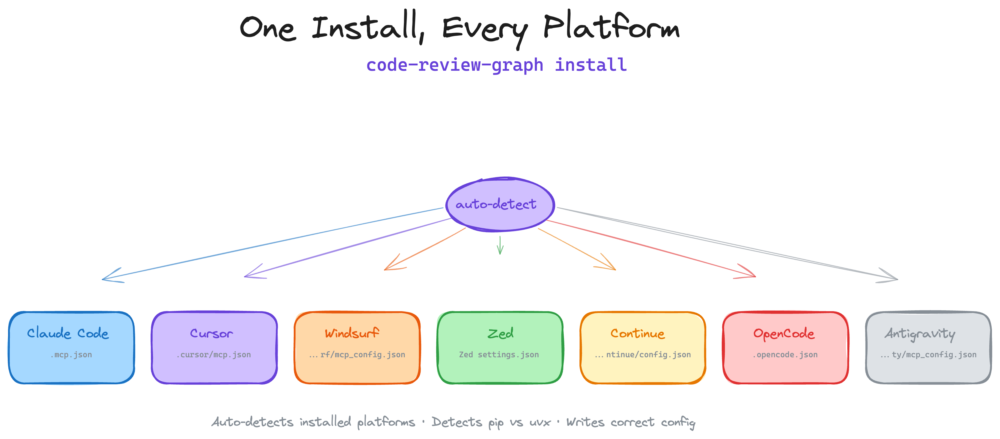
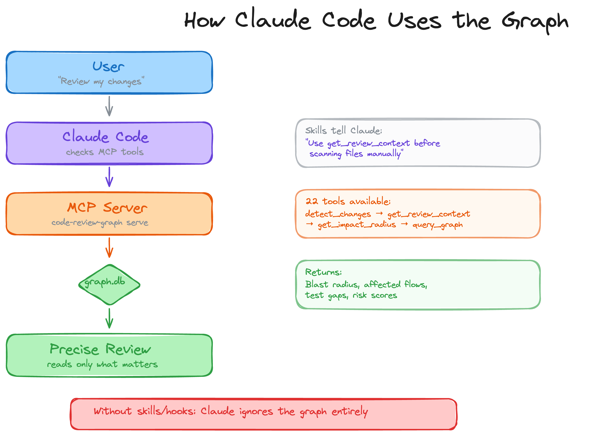
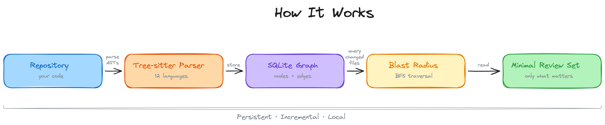
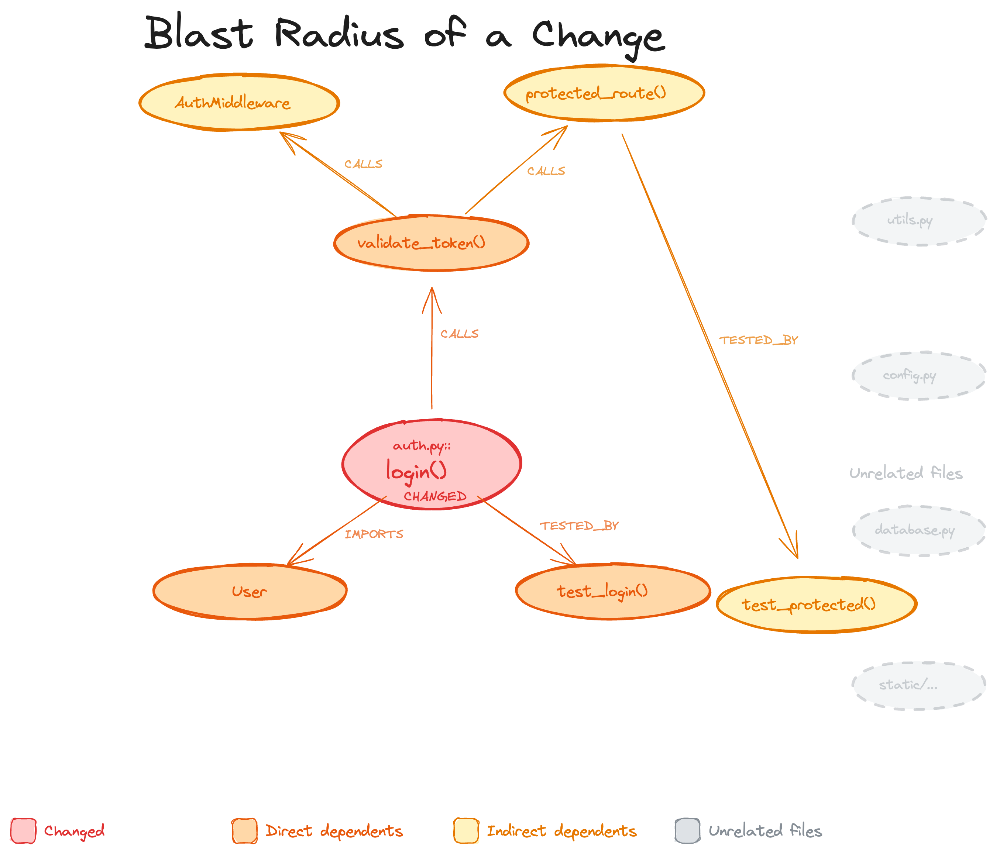
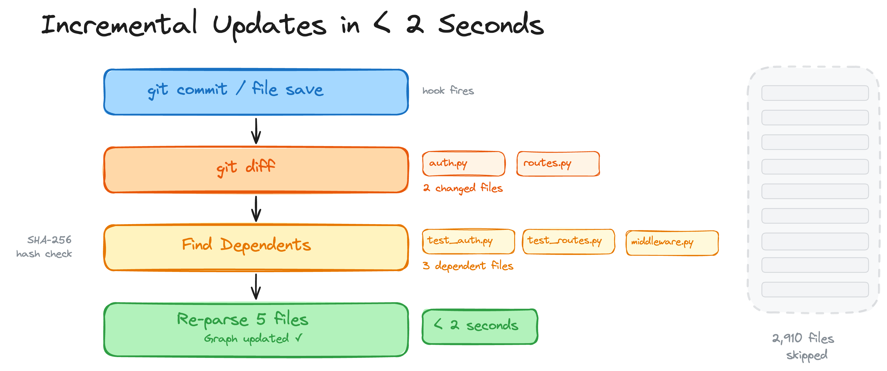
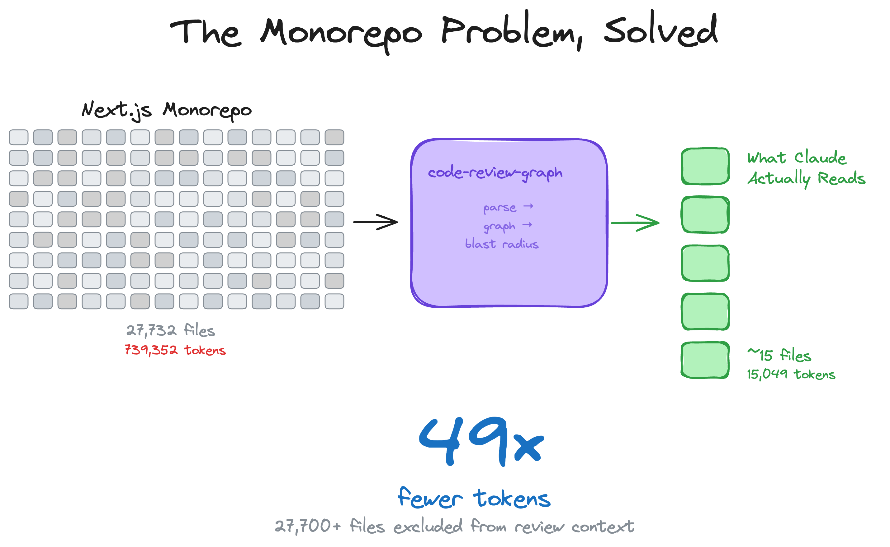
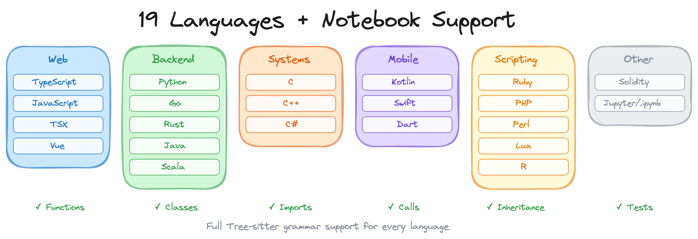
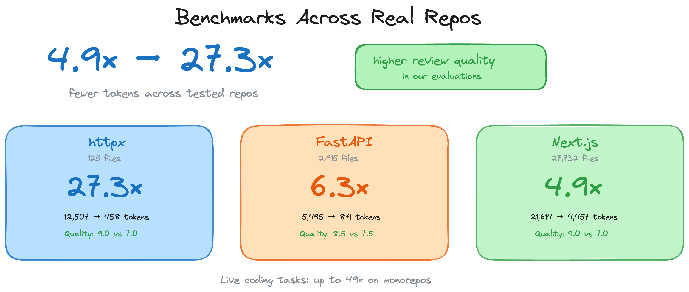

<h1 align="center">code-review-graph</h1>

<p align="center">
  <strong>Stop burning tokens. Start reviewing smarter.</strong>
</p>

<p align="center">
  <a href="https://code-review-graph.com"></a>
  <a href="https://discord.gg/3p58KXqGFN"></a>
  <a href="https://github.com/tirth8205/code-review-graph/stargazers"></a>
  <a href="https://opensource.org/licenses/MIT"></a>
  <a href="https://github.com/tirth8205/code-review-graph/actions/workflows/ci.yml"></a>
  <a href="https://www.python.org/"></a>
  <a href="https://modelcontextprotocol.io/"></a>
  <a href="#"></a>
</p>

<br>

AI coding tools re-read your entire codebase on every task. `code-review-graph` fixes that. It builds a structural map of your code with [Tree-sitter](https://tree-sitter.github.io/tree-sitter/), tracks changes incrementally, and gives your AI assistant precise context via [MCP](https://modelcontextprotocol.io/) so it reads only what matters.

<p align="center">
  
</p>

---

## Quick Start

```bash
pip install code-review-graph                     # or: pipx install code-review-graph
code-review-graph install          # auto-detects and configures all supported platforms
code-review-graph build            # parse your codebase
```

One command sets up everything. `install` detects which AI coding tools you have, writes the correct MCP configuration for each one, and injects graph-aware instructions into your platform rules. It auto-detects whether you installed via `uvx` or `pip`/`pipx` and generates the right config. Restart your editor/tool after installing.

<p align="center">
  
</p>

To target a specific platform:

```bash
code-review-graph install --platform cursor      # configure only Cursor
code-review-graph install --platform claude-code  # configure only Claude Code
```

Requires Python 3.10+. For the best experience, install [uv](https://docs.astral.sh/uv/) (the MCP config will use `uvx` if available, otherwise falls back to the `code-review-graph` command directly).

Then open your project and ask your AI assistant:

```
Build the code review graph for this project
```

The initial build takes ~10 seconds for a 500-file project. After that, the graph updates automatically on every file edit and git commit.

---

## How It Works

<p align="center">
  
</p>

Your repository is parsed into an AST with Tree-sitter, stored as a graph of nodes (functions, classes, imports) and edges (calls, inheritance, test coverage), then queried at review time to compute the minimal set of files your AI assistant needs to read.

<p align="center">
  
</p>

### Blast-radius analysis

When a file changes, the graph traces every caller, dependent, and test that could be affected. This is the "blast radius" of the change. Your AI reads only these files instead of scanning the whole project.

<p align="center">
  
</p>

### Incremental updates in < 2 seconds

On every git commit or file save, a hook fires. The graph diffs changed files, finds their dependents via SHA-256 hash checks, and re-parses only what changed. A 2,900-file project re-indexes in under 2 seconds.

<p align="center">
  
</p>

### The monorepo problem, solved

Large monorepos are where token waste is most painful. The graph cuts through the noise — 27,700+ files excluded from review context, only ~15 files actually read.

<p align="center">
  
</p>

### 19 languages + Jupyter notebooks

<p align="center">
  
</p>

Full Tree-sitter grammar support for functions, classes, imports, call sites, inheritance, and test detection in every language. Plus Jupyter/Databricks notebook parsing (`.ipynb`) with multi-language cell support (Python, R, SQL), and Perl XS files (`.xs`).

---

## Benchmarks

<p align="center">
  
</p>

All numbers come from the automated evaluation runner against 6 real open-source repositories (13 commits total). Reproduce with `code-review-graph eval --all`. Raw data in [`evaluate/reports/summary.md`](evaluate/reports/summary.md).

<details>
<summary><strong>Token efficiency: 8.2x average reduction (naive vs graph)</strong></summary>
<br>

The graph replaces reading entire source files with a compact structural context covering blast radius, dependency chains, and test coverage gaps.

| Repo | Commits | Avg Naive Tokens | Avg Graph Tokens | Reduction |
|------|--------:|-----------------:|----------------:|----------:|
| express | 2 | 693 | 983 | 0.7x |
| fastapi | 2 | 4,944 | 614 | 8.1x |
| flask | 2 | 44,751 | 4,252 | 9.1x |
| gin | 3 | 21,972 | 1,153 | 16.4x |
| httpx | 2 | 12,044 | 1,728 | 6.9x |
| nextjs | 2 | 9,882 | 1,249 | 8.0x |
| **Average** | **13** | | | **8.2x** |

**Why express shows <1x:** For single-file changes in small packages, the graph context (metadata, edges, review guidance) can exceed the raw file size. The graph approach pays off on multi-file changes where it prunes irrelevant code.

</details>

<details>
<summary><strong>Impact accuracy: 100% recall, 0.54 average F1</strong></summary>
<br>

The blast-radius analysis never misses an actually impacted file (perfect recall). It over-predicts in some cases, which is a conservative trade-off — better to flag too many files than miss a broken dependency.

| Repo | Commits | Avg F1 | Avg Precision | Recall |
|------|--------:|-------:|--------------:|-------:|
| express | 2 | 0.667 | 0.50 | 1.0 |
| fastapi | 2 | 0.584 | 0.42 | 1.0 |
| flask | 2 | 0.475 | 0.34 | 1.0 |
| gin | 3 | 0.429 | 0.29 | 1.0 |
| httpx | 2 | 0.762 | 0.63 | 1.0 |
| nextjs | 2 | 0.331 | 0.20 | 1.0 |
| **Average** | **13** | **0.54** | **0.38** | **1.0** |

</details>

<details>
<summary><strong>Build performance</strong></summary>
<br>

| Repo | Files | Nodes | Edges | Flow Detection | Search Latency |
|------|------:|------:|------:|---------------:|---------------:|
| express | 141 | 1,910 | 17,553 | 106ms | 0.7ms |
| fastapi | 1,122 | 6,285 | 27,117 | 128ms | 1.5ms |
| flask | 83 | 1,446 | 7,974 | 95ms | 0.7ms |
| gin | 99 | 1,286 | 16,762 | 111ms | 0.5ms |
| httpx | 60 | 1,253 | 7,896 | 96ms | 0.4ms |

</details>

<details>
<summary><strong>Limitations and known weaknesses</strong></summary>
<br>

- **Small single-file changes:** Graph context can exceed naive file reads for trivial edits (see express results above). The overhead is the structural metadata that enables multi-file analysis.
- **Search quality (MRR 0.35):** Keyword search finds the right result in the top-4 for most queries, but ranking needs improvement. Express queries return 0 hits due to module-pattern naming.
- **Flow detection (33% recall):** Only reliably detects entry points in Python repos (fastapi, httpx) where framework patterns are recognized. JavaScript and Go flow detection needs work.
- **Precision vs recall trade-off:** Impact analysis is deliberately conservative. It flags files that *might* be affected, which means some false positives in large dependency graphs.

</details>

---

## Features

| Feature | Details |
|---------|---------|
| **Incremental updates** | Re-parses only changed files. Subsequent updates complete in under 2 seconds. |
| **19 languages + notebooks** | Python, TypeScript/TSX, JavaScript, Vue, Go, Rust, Java, Scala, C#, Ruby, Kotlin, Swift, PHP, Solidity, C/C++, Dart, R, Perl, Lua, Jupyter/Databricks (.ipynb) |
| **Blast-radius analysis** | Shows exactly which functions, classes, and files are affected by any change |
| **Auto-update hooks** | Graph updates on every file edit and git commit without manual intervention |
| **Semantic search** | Optional vector embeddings via sentence-transformers, Google Gemini, or MiniMax |
| **Interactive visualisation** | D3.js force-directed graph with edge-type toggles and search |
| **Local storage** | SQLite file in `.code-review-graph/`. No external database, no cloud dependency. |
| **Watch mode** | Continuous graph updates as you work |
| **Execution flows** | Trace call chains from entry points, sorted by criticality |
| **Community detection** | Cluster related code via Leiden algorithm or file grouping |
| **Architecture overview** | Auto-generated architecture map with coupling warnings |
| **Risk-scored reviews** | `detect_changes` maps diffs to affected functions, flows, and test gaps |
| **Refactoring tools** | Rename preview, dead code detection, community-driven suggestions |
| **Wiki generation** | Auto-generate markdown wiki from community structure |
| **Multi-repo registry** | Register multiple repos, search across all of them |
| **MCP prompts** | 5 workflow templates: review, architecture, debug, onboard, pre-merge |
| **Full-text search** | FTS5-powered hybrid search combining keyword and vector similarity |
| **Task DAG** | Brainstorm-driven task planning with conflict detection, isolation scoring, and blast-radius analysis — stored in the same SQLite graph |

---

## Usage

<details>
<summary><strong>Slash commands</strong></summary>
<br>

| Command | Description |
|---------|-------------|
| `/code-review-graph:build-graph` | Build or rebuild the code graph |
| `/code-review-graph:review-delta` | Review changes since last commit |
| `/code-review-graph:review-pr` | Full PR review with blast-radius analysis |

</details>

<details>
<summary><strong>CLI reference</strong></summary>
<br>

```bash
code-review-graph install          # Auto-detect and configure all platforms
code-review-graph install --platform <name>  # Target a specific platform
code-review-graph build            # Parse entire codebase
code-review-graph update           # Incremental update (changed files only)
code-review-graph status           # Graph statistics
code-review-graph watch            # Auto-update on file changes
code-review-graph visualize        # Generate interactive HTML graph
code-review-graph wiki             # Generate markdown wiki from communities
code-review-graph task-report <task-id>  # Human+LLM markdown report of full task tree
code-review-graph detect-changes   # Risk-scored change impact analysis
code-review-graph register <path>  # Register repo in multi-repo registry
code-review-graph unregister <id>  # Remove repo from registry
code-review-graph repos            # List registered repositories
code-review-graph eval             # Run evaluation benchmarks
code-review-graph serve            # Start MCP server
```

</details>

<details>
<summary><strong>68 MCP tools (28 code-graph + 40 task DAG)</strong></summary>
<br>

Your AI assistant uses these automatically once the graph is built.

**Code-graph tools (28):**

| Tool | Description |
|------|-------------|
| `build_or_update_graph_tool` | Build or incrementally update the graph |
| `get_impact_radius_tool` | Blast radius of changed files |
| `get_review_context_tool` | Token-optimised review context with structural summary |
| `query_graph_tool` | Callers, callees, tests, imports, inheritance queries |
| `semantic_search_nodes_tool` | Search code entities by name or meaning |
| `embed_graph_tool` | Compute vector embeddings for semantic search |
| `list_graph_stats_tool` | Graph size and health |
| `get_docs_section_tool` | Retrieve documentation sections |
| `find_files_by_pattern_tool` | Find files by glob patterns and get their node summaries |
| `find_large_functions_tool` | Find functions/classes exceeding a line-count threshold |
| `list_flows_tool` | List execution flows sorted by criticality |
| `get_flow_tool` | Get details of a single execution flow |
| `get_affected_flows_tool` | Find flows affected by changed files |
| `list_communities_tool` | List detected code communities |
| `get_community_tool` | Get details of a single community |
| `get_architecture_overview_tool` | Architecture overview from community structure |
| `detect_changes_tool` | Risk-scored change impact analysis for code review |
| `refactor_tool` | Rename preview, dead code detection, suggestions |
| `apply_refactor_tool` | Apply a previously previewed refactoring |
| `generate_wiki_tool` | Generate markdown wiki from communities |
| `get_wiki_page_tool` | Retrieve a specific wiki page |
| `list_repos_tool` | List registered repositories |
| `cross_repo_search_tool` | Search across all registered repositories |
| `analyze_edit_region_tool` | Blast radius of a specific line range in a file |
| `audit_workspace_tool` | Consolidated dead code + large functions + cycle audit |
| `trace_dataflow_tool` | Forward BFS data-flow tracing from source to sink |
| `export_scip_tool` | Export graph to SCIP-compatible JSON |
| `import_scip_tool` | Import SCIP JSON document into the graph |

**Task DAG tools (40) — brainstorm-driven task planning:**

> **Single-pipeline discipline**: at most one root task may be open at a time.
> Workflow: brainstorm fully → validate → implement → close → next task.
> `task_create` with no `parent_id` is blocked while an open root exists.
> Most tools (`task_roadmap`, `task_export`, `task_validate`) auto-detect
> the active root when called without an explicit ID.

| Tool | Description |
|------|-------------|
| `task_get_active_root` | Return the single open root task (or null if idle) |
| `task_create` | Create a task (root blocked if another open root exists) |
| `task_update` | Update title, description, status, spec, acceptance_criteria |
| `task_edit` | Surgically edit a text field: search/replace or line-range |
| `task_delete` | Delete a task (cascade deletes subtree) |
| `task_get` | Get a task by ID |
| `task_list` | List tasks with filters: parent_id, status, root_only |
| `task_move` | Move task to a new parent (cycle detection enforced) |
| `task_search` | Keyword search within a task subtree |
| `task_archive` | Archive a task with reason (preserves history) |
| `task_add_edge` | Add depends_on \| blocks \| shares_context \| conflicts_with \| informs edge |
| `task_remove_edge` | Remove an edge between tasks |
| `task_get_edges` | Get incoming/outgoing/both edges for a task |
| `task_get_dag` | Full DAG for a subtree (nodes + all edges) |
| `task_topological_sort` | Topological order of leaf tasks by depends_on |
| `task_link_code` | Link a task to a code node (modifies\|creates\|deletes\|reads\|tests) |
| `task_unlink_code` | Remove code node association |
| `task_get_code_refs` | Get code nodes linked to a task |
| `task_find_by_code_node` | Find all tasks referencing a code node |
| `task_suggest_code_links` | Keyword-based code node suggestions (no auto-linking) |
| `task_find_conflicts` | Leaf tasks with overlapping code refs |
| `task_check_isolation` | Isolation score: internal / (internal + external) |
| `task_blast_radius` | BFS impact from task's code refs through code graph |
| `task_execution_order` | Parallelism-aware execution levels from depends_on |
| `task_validate` | Gate-check: 8 algorithmic checks before coder handoff |
| `task_export` | Full task context export — use `include_analysis=True` for isolation + conflicts |
| `task_export` | Flat handoff structure for design/coder workflows |
| `note_add` | Add a brainstorm note (decision\|question\|assumption\|constraint\|risk) |
| `note_update` | Resolve or update a note |
| `note_list` | List notes (with optional ancestor chain) |
| `note_delete` | Delete a note |
| `contract_add` | Record interface contract between provider and consumer tasks |
| `contract_update` | Advance contract status (proposed→agreed→implemented→verified) |
| `contract_list` | All contracts where task is provider or consumer |
| `task_roadmap` | Progress snapshot: counts, phases, contracts, attention block |
| `task_roadmap_diff` | What changed since a Unix timestamp (for resuming sessions) |
| `task_find_for_impact` | Cross-query: find open tasks in blast radius of changed files |
| `task_suggest_contracts` | Detect implicit code-level deps between tasks needing contracts |
| `task_check_rollup` | Check if parent/ancestors can be closed or archived after a subtask completes |
| `contract_link` | Attach a task to an existing contract as provider or consumer |
| `contract_unlink` | Remove all links between a task and a contract |

**MCP Prompts** (5 workflow templates):
`review_changes`, `architecture_map`, `debug_issue`, `onboard_developer`, `pre_merge_check`

</details>

<details>
<summary><strong>Configuration</strong></summary>
<br>

To exclude paths from indexing, create a `.code-review-graphignore` file in your repository root:

```
generated/**
*.generated.ts
vendor/**
node_modules/**
```

Optional dependency groups:

```bash
pip install code-review-graph[embeddings]          # Local vector embeddings (sentence-transformers)
pip install code-review-graph[google-embeddings]   # Google Gemini embeddings
pip install code-review-graph[communities]         # Community detection (igraph)
pip install code-review-graph[eval]                # Evaluation benchmarks (matplotlib)
pip install code-review-graph[wiki]                # Wiki generation with LLM summaries (ollama)
pip install code-review-graph[all]                 # All optional dependencies
```

</details>

---

## Task DAG Workflow

The Task DAG system enforces a strict **brainstorm-first, implement-second** discipline. The core insight: every ambiguity you resolve during brainstorming is a rewrite you avoid during implementation.

### The Problem It Solves

Without structured planning, a typical AI-assisted feature looks like this:

```
Ask AI to implement feature
→ AI writes code
→ "Wait, how should we handle auth?"
→ AI rewrites auth layer
→ "And what about error handling?"
→ AI rewrites error handling
→ "The schema changed, update the models"
→ AI rewrites models
→ ... repeat until everyone is frustrated
```

Each rewrite erases prior work. The root cause is always the same: implementation started before all constraints, design decisions, and architectural questions were resolved.

### The Correct Workflow

```
1. BRAINSTORM  →  2. VALIDATE  →  3. IMPLEMENT  →  4. CLOSE
```

#### Phase 1: Brainstorm (Do NOT write code yet)

Create the root task and decompose it until every leaf is small enough to implement without ambiguity:

```
task_create("Add OAuth 2.0 login")          # root task — single pipeline starts
task_create("Google OAuth flow", parent=..) # L1 subtask
task_create("Token storage", parent=..)     # L1 subtask
task_create("Refresh rotation", parent=..)  # L2 subtask under Token storage
```

**For each leaf task, conduct a structured interview:**

- What existing code does this touch? → `semantic_search_nodes_tool`, `task_link_code`
- What new structures does this introduce? → `contract_add` (design entities)
- What does this depend on? → `task_add_edge(type="depends_on")`
- What are the acceptance criteria? → `task_update(acceptance_criteria=...)`
- Are there open questions? → `note_add(type="question")`
- Are there assumptions to verify? → `note_add(type="assumption")`
- Are there constraints? → `note_add(type="constraint")`

**Check coverage with cross-queries:**

```
task_find_for_impact(["src/auth.py"])   # What tasks cover files in blast radius?
task_blast_radius(task_id)              # How many code nodes are uncovered?
suggest_contracts(root_id)              # Hidden dependencies needing interfaces?
check_isolation(task_id)               # Is isolation score acceptable?
```

Any `uncovered_nodes` in blast radius = a part of the codebase this task touches but no subtask addresses. Ask the user about it. Add a subtask or a note explaining why it is intentionally out of scope.

**Resolve all open items before moving on:**

```
note_list(root_id, include_children=True, status="open")   # All unresolved notes
task_roadmap()                                              # attention block
task_validate()                                            # 9 algorithmic checks
```

Do not proceed to implementation while `task_validate` reports errors or `task_roadmap` has unresolved questions/assumptions.

#### Phase 2: Validate (Gate check)

Before writing a single line of code, run the gate check:

```
task_validate()
```

Expected clean output:
```
errors:   []
warnings: []  (or only known/accepted warnings)
ok:
  - All leaf tasks have descriptions
  - All leaf tasks have acceptance criteria
  - All leaf tasks have code references
  - No open questions
  - No unverified assumptions
  - All active contracts are agreed or better
  - No dependency cycles
  - All ready tasks have their deps done
  - No parent tasks with direct code refs
```

If `errors` is non-empty — resolve them. If warnings exist — review each one and either fix it or add a `note(type="decision")` explaining why it is acceptable.

#### Phase 3: Implement

Only now hand off to the coder. Use `task_export` as the primary context document:

```
task_export(task_id, include_analysis=True)
```

This gives the coder:
- The task spec and acceptance criteria
- Parent chain (full decision history including ancestor notes)
- Code nodes to modify with file + line ranges
- Contracts (interfaces the implementation must satisfy)
- Isolation score (how coupled is this to external code?)
- Conflicts (which sibling tasks touch the same nodes?)
- `pipeline_state.ready_for_coder: true`

As each leaf is completed:

```
task_update(task_id, status="done")
task_check_rollup(task_id)          # Can the parent close too?
```

`task_check_rollup` tells you whether all siblings are done and the parent can be closed — no manual tree traversal needed.

#### Phase 4: Close

When all subtasks are done:

```
task_roadmap()     # progress: 100%, all phases done
task_update(root_id, status="done")
```

The pipeline is now idle. `task_get_active_root` returns `null`. A new root task can be created.

### Design Entities (Contracts)

When brainstorming introduces a new data structure or interface that does not yet exist in code, do not add a note — create a contract:

```python
# Wrong: loses the structure when the note is buried deep
note_add(task_id, type="decision", content="OAuthToken = { access_token, refresh_token, expires_at }")

# Right: a first-class design entity
contract_add(
    name="OAuthToken",
    contract_type="schema",
    definition="{ access_token: str, refresh_token: str, expires_at: datetime, provider: Literal['google','github'] }",
    scope_task_id=root_id,
)
contract_link(contract_id, provider_task_id, role="provider")
contract_link(contract_id, consumer_task_id_1, role="consumer")
contract_link(contract_id, consumer_task_id_2, role="consumer")
```

One definition — many consumers. If the schema changes, update once, all consumers see it instantly. When the code is written, link the contract to the actual class:

```python
contract_update(contract_id, qualified_name="src/auth/token.py::OAuthToken")
```

Now `task_export` for any consumer shows the current definition side-by-side with the existing code — the coder sees exactly what to implement.

### Key Rules

| Rule | Rationale |
|---|---|
| One open root task at a time | Forces completion before the next feature starts |
| Brainstorm fully before implementing | Every resolved ambiguity = one avoided rewrite |
| Leaf tasks have code refs | Links planning to code — enables blast-radius cross-queries |
| Contracts for shared structures | One source of truth for interfaces shared across subtasks |
| `task_validate` must pass before coding | Algorithmic gate that catches gaps humans miss |
| `task_check_rollup` after every completion | Keeps the tree status accurate without manual traversal |

### Quick Reference

```
# Start
task_get_active_root()                              # check if pipeline is idle
task_create("Feature X")                            # create root

# Decompose
task_create("Subtask Y", parent_id=root_id)
task_add_edge(child_id, blocker_id, "depends_on")

# Interview each leaf
semantic_search_nodes_tool("AuthService")           # find code nodes → get id + qualified_name
task_link_code(task_id, qualified_name="src/auth.py::AuthService", ref_type="modifies")
note_add(task_id, type="question", content="Should tokens be stored in httpOnly cookies?")
contract_add(name="OAuthToken", ..., scope_task_id=root_id)

# Check coverage
task_find_for_impact(["src/auth.py"])               # what's covered?
task_blast_radius(task_id)                          # what's uncovered?
suggest_contracts(root_id)                          # hidden dependencies?
note_list(root_id, include_children=True, status="open")  # unresolved items

# Gate check
task_validate()                                     # must be error-free

# Implement
task_export(leaf_task_id, include_analysis=True)    # full context for coder
task_update(leaf_task_id, status="done")
task_check_rollup(leaf_task_id)                     # can parent close?

# Close
task_update(root_id, status="done")
task_get_active_root()                              # → null, pipeline idle
```

---

## Contributing

```bash
git clone https://github.com/tirth8205/code-review-graph.git
cd code-review-graph
python3 -m venv .venv && source .venv/bin/activate
pip install -e ".[dev]"
pytest
```

<details>
<summary><strong>Adding a new language</strong></summary>
<br>

Edit `code_review_graph/parser.py` and add your extension to `EXTENSION_TO_LANGUAGE` along with node type mappings in `_CLASS_TYPES`, `_FUNCTION_TYPES`, `_IMPORT_TYPES`, and `_CALL_TYPES`. Include a test fixture and open a PR.

</details>

## Licence

MIT. See [LICENSE](LICENSE).

<p align="center">
<br>
<a href="https://code-review-graph.com">code-review-graph.com</a><br><br>
<code>pip install code-review-graph && code-review-graph install</code><br>
<sub>Works with Claude Code, Cursor, Windsurf, Zed, Continue, OpenCode, and Antigravity</sub>
</p>
